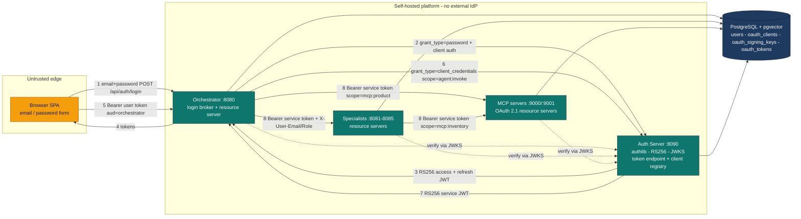

# Phase 2.7 — Self-Hosted OAuth2 Authorization Server (offline, no external IdP)

**Status:** Phase A done (self-hosted AS built, tested, verified against a live Docker stack) ·
**Depends on:** 09 (public storefront auth split) · **Additive, flag-gated**

## Why

Three trust boundaries currently rely on static, long-lived secrets validated with a single symmetric key:

1. **Browser → Orchestrator** — self-issued HS256 JWT signed with a static `JWT_SECRET`. No token
   endpoint, no key rotation, no standards-based introspection.
2. **Orchestrator → Specialists (A2A)** — a single static `AGENT_SHARED_SECRET` header; forwarded
   `X-User-Email` / `X-User-Role` are trusted on the strength of that one secret.
3. **MCP servers (:9000/:9001)** — zero authentication. Both Python `FastMCP` apps and the .NET MCP
   host accept any caller, with `DATABASE_URL`-backed data access wide open.

An earlier version of this plan fronted all three with **Microsoft Entra ID**. That was rejected: this
platform is offline-first with its own self-hosted registration/login and must not depend on an
external identity provider. This rewrite keeps the OAuth2 goal but moves the issuer *inside the repo*:
a small **self-hosted OAuth2 Authorization Server** becomes the single trusted token issuer for both
the Python and .NET stacks. User login and every service-to-service call become genuinely
OAuth2-compliant — real RS256 tokens, a real token endpoint, a real JWKS — with no internet or cloud
dependency.

Nothing here replaces the current model. Everything is gated behind `AUTH_MODE` (`local` default) and
`MCP_AUTH_ENABLED` (`false` default), so `./scripts/dev.sh` with only an `OPENAI_API_KEY` keeps working
with zero external dependencies. The auth-server is just another container in the compose stack when an
operator opts in.

## Decisions (locked)

- **The Authorization Server is a new standalone service** at `agents/python/auth_server/`, compose
  service `auth-server` on `:8090`. It is the single issuer (`iss`) for both stacks and the only
  component holding the signing private key. Rationale: textbook OAuth2 separates the AS from resource
  servers; the repo already treats "specialist agent" and "MCP server" as independently-runnable
  services with their own Dockerfile target, so a distinct AS is the natural fit and the better teaching
  artifact. Folding token issuance into the orchestrator would blur the resource-server boundary and
  make the .NET stack depend on the Python orchestrator being up for its own service tokens.
- **`AUTH_MODE=local|oauth`** is the master switch. `local` = today's HS256 + shared secret (unchanged
  default). `oauth` = the self-hosted AS everywhere. No mixed mode within a single deployment.
- **Library: `authlib`** (built/tested against 1.7.2, the current release; actively maintained). It
  implements RFC 6749 (AuthorizationServer + grant classes), RFC 9068 (JWT-profile access tokens via
  `authlib.oauth2.rfc9068.JWTBearerTokenGenerator` — subclassed rather than hand-rolled, see
  Implementation notes below), RFC 6750 (bearer), and RFC 7517/7519 (JWK/JWT). **Key generation and
  signing use `joserfc` directly** (`joserfc.jwk.RSAKey`, `joserfc.jwt`), not `authlib.jose` — as of
  1.7.x authlib's own JWT bearer token generator is built on `joserfc` internally and `authlib.jose` is
  deprecated (still functional, but flagged for removal before 2.0; `joserfc` is already a transitive
  dependency of `authlib`, so this adds no new package). We use
  `authlib.oauth2.rfc6749.AuthorizationServer` (framework-agnostic base — there is no official
  Starlette/FastAPI integration, so ~100 lines of request/response glue, implemented in
  `auth_server/server.py`), the `ClientCredentialsGrant` (used as-is), `ResourceOwnerPasswordCredentialsGrant`,
  and `RefreshTokenGrant` (both subclassed for DB-backed user/token lookups). **Resource servers do not
  import authlib** — they verify RS256 with the `jwt.PyJWKClient` already present in `shared/auth.py`,
  keeping specialists/MCP lean.
- **Signing is RS256 with an AS-generated keypair persisted in Postgres** (`oauth_signing_keys`), not a
  shared symmetric secret. The AS mints tokens with the private key; every resource server (orchestrator,
  specialists, MCP, .NET) verifies against the public key fetched from `/.well-known/jwks.json`. No
  resource server ever holds signing material.
- **User login uses the ROPC (`password`) grant, brokered by the orchestrator.** The frontend keeps its
  existing email/password form and keeps calling `/api/auth/login` / `/refresh` / `/signup` — no
  redirect, no browser-to-AS CORS, no client secret in the browser. The orchestrator is a **confidential
  first-party client** that performs the ROPC grant against the AS on the user's behalf and returns the
  resulting RS256 access/refresh tokens to the browser. ROPC is discouraged for *third-party* clients; it
  is legal and appropriate for a confidential first-party client and is the right call to preserve the
  offline login UX. This is a deliberate, documented trade-off, not a reinvented flow. Signup stays an
  app concern at the orchestrator (bcrypt insert into `users`); only credential-exchange moves to the AS.
- **Service-to-service uses the client-credentials grant.** Orchestrator→specialists and
  orchestrator/specialists→MCP each acquire a short-lived RS256 service token (`scope=agent:invoke` or
  `scope=mcp:*`). End-user identity continues to flow in `X-User-Email` / `X-User-Role`; the service
  token authenticates the *caller service*, cryptographically and with expiry, replacing the static
  `AGENT_SHARED_SECRET`. `GUARDRAILS_STRICT_IDENTITY=true` is mandatory in `oauth` mode.
- **Scopes gate API surface; roles gate business logic — never conflated.** Scope set: `api:chat` (user
  token → orchestrator), `agent:invoke` (A2A), `mcp:product` / `mcp:inventory` (per-MCP). Audiences:
  `ecommerce-orchestrator`, `ecommerce-agents`, `mcp-product`, `mcp-inventory`. The `customer|seller|admin`
  role stays a separate custom `role` claim consumed by tool-level RBAC exactly as today.
- **Static, seeded client registry** (`oauth_clients`). This is offline-first with a fixed set of
  first-party clients — no dynamic registration. The seeder provisions one confidential client per
  service; the .NET stack reuses the same `client_id`s (same logical services, mutually exclusive at
  runtime), mirroring the existing byte-compatible-secret design.
- **MCP servers become OAuth 2.1 resource servers** via the `mcp` SDK's `TokenVerifier` + `AuthSettings`
  seam — but the issuer is now the self-hosted AS, not Entra. We write a JWKS-backed `TokenVerifier`
  against the AS. Gated independently via `MCP_AUTH_ENABLED`.
- **No prompt changes.** Identity plumbing only; YAML prompts untouched.

## Target architecture (oauth mode)



Amber marks the only real trust boundary — the untrusted browser edge. Everything else is self-hosted
(teal); data is dark-blue. There is no external-IdP node.

---

## Phase A — Build the Authorization Server ✅ done

Verified end to end against a live Docker stack: seeded `product-discovery` client → derived +
bcrypt-verified secret → real `client_credentials` token round trip → offline signature validation
against the published JWKS. All three grants (`client_credentials`, `password`, `refresh_token`) plus
their error paths are covered by 27 passing tests (unit + integration, real Postgres via
`testcontainers`, zero mocks). Full existing suite (401 tests) re-run clean afterward — zero
regressions in `AUTH_MODE=local` (default) behavior. No consumer service changes yet.

**Schema (appended to `docker/postgres/init.sql`, additive, `CREATE TABLE IF NOT EXISTS`)**

- `oauth_clients(client_id PK, client_secret_hash, client_name, is_confidential bool,
  allowed_grant_types text[], allowed_scopes text[], allowed_audiences text[],
  token_endpoint_auth_method text, created_at)`.
- `oauth_signing_keys(kid PK, alg text, public_jwk jsonb, private_pem_enc bytea, is_active bool,
  created_at, retired_at)`.
- `oauth_tokens(id PK, client_id, subject, token_type text, token_hash, scope text, audience text,
  issued_at, expires_at, revoked bool)` — refresh tokens only; access tokens stay stateless (validated
  via JWKS, never stored).

**What was built** (`agents/python/auth_server/`)

- `keys.py` — RSA keypair bootstrap via `joserfc.jwk.RSAKey.generate_key(...)`, idempotent (a second
  boot reuses the active row), private PEM encrypted at rest with `AUTH_SIGNING_KEY_ENCRYPTION_KEY`
  (Fernet, key stretched via SHA-256) when set, plaintext + a loud `logger.warning` otherwise; `get_jwks()`
  serves the public JWK set.
- `token.py` — `AccessTokenGenerator(authlib.oauth2.rfc9068.JWTBearerTokenGenerator)`. Subclassing
  authlib's own RFC 9068 implementation instead of hand-rolling saved most of the originally-scoped
  work — the base class already builds the full spec-compliant claim set. This subclass only adds: the
  active key's `kid` in the JWS header (the base class's `access_token_generator` hard-codes
  `{"alg", "typ"}` with no extension point for `kid`, so the method is overridden wholesale rather than
  patched), scope→audience mapping driven by `settings.AUTH_ORCH_AUDIENCE` /
  `AUTH_AGENT_AUDIENCE` / `MCP_*_AUDIENCE`, and the `role` claim for user (ROPC) tokens.
- `clients.py` — `Client(authlib.oauth2.rfc6749.ClientMixin)` + `ClientStore`, an **in-memory cache**
  loaded once from `oauth_clients` at startup. This isn't just a performance nicety — authlib calls
  `query_client` **synchronously**, so a DB-backed lookup per request isn't an option without extra
  machinery; a fixed, seeded registry that's small enough to hold in memory sidesteps the problem
  entirely for client lookups.
- `grants.py` — `ResourceOwnerPasswordCredentialsGrant` and `RefreshTokenGrant` subclassed for
  DB-backed `authenticate_user`/`authenticate_refresh_token`; `ClientCredentialsGrant` used unmodified.
  `RefreshTokenGrant.INCLUDE_NEW_REFRESH_TOKEN` **already defaults to `False` in authlib** — no override
  needed for the non-rotating behavior the design calls for. `revoke_old_credential` is an explicit
  no-op (must not invalidate the one refresh token the browser holds).
- `server.py` — the `AuthorizationServer` Starlette bridge (`create_oauth2_request`,
  `create_json_request`, `handle_response`, `query_client`, `save_token`), plus a `send_signal`
  no-op override (a required hook for a framework signal system authlib expects but this integration
  doesn't use — omitting it raises `NotImplementedError` on the very first successful client
  authentication).
- `main.py` — Starlette app: `/health`, `/.well-known/jwks.json`, `/.well-known/oauth-authorization-server`
  (RFC 8414), `POST /oauth/token`.
- `shared/oauth/client_secrets.py` — `derive_client_secret(seed_key, client_id)`
  (`hmac_sha256`), imported by both `scripts/seed.py` and (in later phases) every service.

**Steps that materially differed from the original estimate**

1. ~~Service skeleton + keypair bootstrap~~ → as scoped, but using `joserfc` not `authlib.jose` (see
   Decisions above).
2. ~~authlib AuthorizationServer wiring~~ → as scoped, plus the `send_signal` override and the
   sync/async bridge (next point) that weren't anticipated.
3. **New, not originally scoped: the sync/async bridge (`auth_server/_bridge.py`).** authlib's entire
   OAuth2 core — `AuthorizationServer`, every grant class, `ClientMixin`/`TokenMixin` — is synchronous
   with no async support at all, while this repo's DB access (asyncpg) is entirely async. Rather than
   adding a second, synchronous Postgres driver just for this one service, the token endpoint runs
   authlib's synchronous call chain in a worker thread (`asyncio.to_thread`), and any callback that
   needs the database (`authenticate_user`, `authenticate_refresh_token`, `save_token`) submits a
   coroutine back onto the main event loop — the one that owns the asyncpg pool — via
   `asyncio.run_coroutine_threadsafe(...).result()`, blocking only the worker thread while it waits.
   This is the single biggest piece of unplanned design work in Phase A; budget for it explicitly if
   this pattern is reused (it will be needed again for anything DB-backed that authlib calls
   synchronously in later phases, though Phases B/C/D's own code — the resource-server verifiers — is
   plain async and doesn't need it).
4. **Grant classes** — as scoped, simpler than expected (see `RefreshTokenGrant` default above).
5. **Client registry + seeder** — as scoped.

**Two runtime gotchas that will bite anyone extending this** (also filed under Gotchas below):

- **`AUTHLIB_INSECURE_TRANSPORT=1` is required.** authlib refuses to build a request over a URI it
  doesn't consider secure (its own rule: `https://` or `http://localhost`) — see
  `authlib.common.security.is_secure_transport`. This platform runs every internal service, including
  this one, over plain HTTP within a private network (no pod-to-pod TLS today), so this env var — set
  at `auth_server` package-import time — is authlib's own documented escape hatch, not a workaround.
  Revisit if/when mTLS or an ingress-terminated-TLS mesh is added (see the "Enable HTTPS everywhere"
  hardening-checklist row).
- **Header case-sensitivity.** ASGI delivers header names lowercase, but authlib's
  `extract_basic_authorization` does a case-*sensitive* `headers.get("Authorization")`. A plain
  `dict(request.headers)` (lowercase keys) silently never matches, so client authentication would fail
  on every single request. Fix: pass `httpx.Headers` (case-insensitive both ways) as the request headers
  container instead of a plain dict.

Seeded clients (confidential):

| client_id | grants | scopes | audiences |
|---|---|---|---|
| `orchestrator` | password, refresh_token, client_credentials | api:chat, agent:invoke, mcp:product, mcp:inventory | ecommerce-agents, mcp-product, mcp-inventory |
| `product-discovery` | client_credentials | agent:invoke, mcp:product | ecommerce-agents, mcp-product |
| `inventory-fulfillment` | client_credentials | agent:invoke, mcp:inventory | ecommerce-agents, mcp-inventory |
| `order-management`, `pricing-promotions`, `review-sentiment` | client_credentials | agent:invoke | ecommerce-agents |

MCP servers are resource servers, not clients — no rows. The .NET orchestrator/specialists reuse these
same `client_id`s.

**Tests shipped with this phase** (`agents/python/tests/`, all real Postgres via `clean_db`, zero LLM):
- `test_auth_server_keys.py` (5 tests) — keypair bootstrap idempotency, JWKS shape, unencrypted-at-rest
  warning, encrypted round trip.
- `test_auth_server_grants.py` (14 tests) — `ClientStore`/`Client` (load, secret check, scope
  intersection, grant-type check), `ResourceOwnerPasswordCredentialsGrant.authenticate_user` (success,
  wrong password, unknown email, inactive account), `RefreshTokenGrant` (valid/expired/revoked/unknown
  refresh tokens, the client-credentials-has-no-user edge case, the non-rotating no-op).
- `test_auth_server_integration.py` (8 tests) — full `/oauth/token` round trips through the real
  authlib call chain for all three grants: scoped-token issuance with correct `aud`/`scope`/`role`
  claims, wrong secret (401), disallowed grant type (400), out-of-scope requests trimmed not rejected,
  ROPC issuing both tokens with the refresh token persisted (hashed) in `oauth_tokens`, refresh
  confirmed non-rotating (same token works twice), unknown refresh token rejected.

**Done when**
- The AS issues valid RS256 tokens for client-credentials, password, and refresh grants; JWKS and
  RFC 8414 metadata resolve; tokens validate offline. `AUTH_MODE=local` behavior and the quick-start are
  untouched (the `auth-server` container simply isn't required).

---

## Phase B — User login via the AS (orchestrator broker) ✅ done (Python + .NET)

Verified end to end against a live Docker stack (`AUTH_MODE=oauth`, real seeded user, real
`docker compose` orchestrator + auth-server): logged in through `/api/auth/login`, got back real
AS-issued RS256 tokens, refreshed twice with the same refresh token (confirming non-rotation), and
called a `require_auth`-gated route with the access token. 30 new/extended tests, all passing; full
existing suite (421 tests) re-run clean, zero regressions in `local` mode.

**A real gap found only by the live verification, not by unit tests alone:** ~18 routes in
`orchestrator/routes.py` (`list_conversations`, `get_conversation`, cart/checkout/order routes, etc.)
read `user.get("user_id", "")` straight off the `require_auth` payload and use it as a UUID query
parameter against `conversations.user_id`/`orders.user_id`/etc. The local HS256 token embeds this
(`create_access_token(email, role, user_id)`); the AS's ROPC token initially did not — its OAuth `sub`
claim is email, not the DB primary key. First attempt: `/api/auth/login` succeeded but the very next
authenticated request 500'd with `invalid input for query argument $1: '' (invalid UUID '')`. **Fixed
at the source**: `auth_server/grants.py`'s `User` wrapper now carries a `user_id` field (from
`users.id`), and `auth_server/token.py::get_extra_claims` stamps it as its own `user_id` claim
alongside `role`. Anyone building the .NET side must replicate this — the .NET routes almost certainly
have the same `user_id`-from-token dependency to check for.

**What was built (Python)**

- `shared/oauth/verifier.py` — `RS256Verifier` (`jwt.PyJWKClient(AUTH_SERVER_JWKS_URL)`, TTL-cached),
  validates `iss`/`aud`/`exp`/signature and an optional required scope.
- `shared/factory.py` — `get_token_verifier()` (`@lru_cache`, mirrors the `get_agent_registry` pattern):
  returns `None` in `local` mode (RS256Verifier is never constructed), the verifier singleton in
  `oauth` mode.
- `shared/oauth/service_client.py` — `request_token(grant_type, **form)`, an httpx POST to the AS token
  endpoint authenticated as the orchestrator's own client (`OAUTH_CLIENT_ID`/derived secret).
- `shared/auth.py` (`AgentAuthMiddleware`) and `orchestrator/routes.py` (`require_auth`) — both branch
  on `settings.AUTH_MODE` right before token decode; `local` path is byte-for-byte the original code,
  now in an `else` branch. `optional_auth` needed no change — it already delegates to `require_auth`.
- `orchestrator/routes.py::login` — in oauth mode, relays a `password` grant to the AS (the AS is the
  sole authority on the credentials; the route does **not** also run its own `verify_password`, since
  that would just re-check what the AS already checked), then does a plain `SELECT` (no password
  column) for the response body's `user: {...}` fields. `signup` is untouched.
- `orchestrator/routes.py::refresh_token` — relays a `refresh_token` grant, returns exactly
  `{"access_token": ...}` — matches today's contract, no new key, consistent with the AS's
  non-rotating refresh grant.
- Startup guardrails (`OAUTH_SEED_KEY` unsafe-default check, `AUTH_SIGNING_KEY_ENCRYPTION_KEY`
  required in prod+oauth) landed in Phase A already — nothing further needed here; `AUTH_SERVER_*` URLs
  have working localhost defaults so an emptiness check would be a false economy.

**Tests shipped**: `tests/test_rs256_verifier.py` (9, new — per-test RSA keypair + monkeypatched
`PyJWKClient.fetch_data` as the JWKS stub, not a real HTTP server); `tests/test_optional_auth.py` (+4)
and `tests/test_auth_identity_validation.py` (+3) extended with oauth-mode branch cases (a stub
verifier object, not a real AS); `tests/test_orchestrator_oauth_login.py` (4, new) — full FastAPI route
tests via `httpx.ASGITransport`, `request_token` monkeypatched (an httpx call to a separate service,
not DB/LLM), real Postgres for the `users` row.

**.NET — done, verified end to end against a live Docker stack** (`AUTH_MODE=oauth`, real seeded
users, real `docker compose -f docker-compose.dotnet.yml` orchestrator + auth-server): logged in as
both a `customer` and an `admin` demo user through `/api/auth/login`, got back real AS-issued RS256
tokens, called `/api/profile` (resolves full DB identity via the token's `user_id` claim — confirming
.NET picked up the same `user_id`-claim fix Python needed, see below) and `/api/admin/requests`
(confirmed `customer` → 403, `admin` → 200 — real RBAC, not just "no 401"), and refreshed successfully
(non-rotating, matches Python's contract). Local-mode (`AUTH_MODE=local`, the default) regression-
checked with the identical sequence — zero behavior change, and the pre-existing bug below is now
fixed there too.

**A second, more serious gap found only by the .NET unit tests, independent of the `user_id` gap
above:** `JwtSecurityTokenHandler`'s default `MapInboundClaims = true` silently renames short claim
types on validation — `sub` → the XML-namespace nameidentifier URI, `email` → the emailaddress URI,
`role` → the MS role URI. `AgentAuthMiddleware.cs` reads `principal.FindFirst("email")` /
`FindFirst("role")` by their bare short names, which is not just a bug in the new RS256 path — it was
**already broken in the existing `local`-mode HS256 path**, predating this feature entirely. Every
Bearer-authenticated request in `AuthMode=local` was silently stamping `RequestContext` with
`email=""` and `role="customer"`, regardless of who actually logged in (verified by reproducing the
exact HS256 issue→validate round trip standalone: `FindFirst("email")`/`FindFirst("role")` both
returned `null` after `ValidateToken`). Because `OrchestratorTestHost`'s test harness bypasses
`AgentAuthMiddleware` entirely (stamps identity straight from an `X-Test-Email` header), and no prior
test exercised a real Bearer-token request through the middleware, this had zero coverage and went
unnoticed. **Fixed** by adding `MapInboundClaims = false` to both `JwtTokenService`'s and
`AgentAuthMiddleware`'s own `JwtSecurityTokenHandler` instances — a pure bugfix, not an OAuth-specific
change, confirmed safe since nothing in the codebase depended on the remapped (broken) claim types.

**What was built (.NET)**

- `ECommerceAgents.Shared/Auth/JwksKeyProvider.cs` (new) — hand-rolled JWKS fetch + TTL cache
  (correction #2 — deliberately not `ConfigurationManager<OpenIdConnectConfiguration>`, since the AS
  serves RFC 8414 metadata, not OIDC discovery).
  `JwtTokenService.cs` gains `ValidateOAuth(token, signingKeys, audience, requiredScope?)` — RS256
  validation against the JWKS, with the `MapInboundClaims = false` fix above.
- `AgentAuthMiddleware.cs` — constructor now takes `JwtTokenService` + `JwksKeyProvider`; the Bearer
  branch splits on `_settings.AuthMode == "oauth"` (JWKS-based RS256, required scope `api:chat`) vs. the
  original HS256 path (now in the `else`, byte-for-byte the old logic plus the claim-mapping fix).
- `AgentSettings.cs`/`AgentSettingsLoader.cs`/`AgentSettingsValidator.cs` — `AuthMode`,
  `AuthServerIssuer`, `AuthServerJwksUrl`, `AuthServerTokenUrl`, `AuthJwksCacheTtl`, `OAuthClientId`,
  `OAuthClientSecret`, `OAuthSeedKey`, `AuthOrchAudience`, `AuthAgentAudience` — same env var names as
  Python, same unsafe-default guard on `OAUTH_SEED_KEY`.
- `ECommerceAgents.Shared/Auth/ClientSecretDeriver.cs` (new) — HMAC-SHA256(seed, client_id) hex, byte-
  identical to Python's `derive_client_secret` (cross-checked against a Python-computed reference
  vector in the test suite).
- `ECommerceAgents.Shared/Auth/AuthServerClient.cs` (new) — POSTs to the AS token endpoint with HTTP
  Basic client auth (derived or explicit secret), mirrors `shared/oauth/service_client.py::request_token`.
- `AuthRoutes.cs` — `Login`/`Refresh` branch on `AuthMode`: in `oauth` mode, `Login` relays a `password`
  grant to the AS (does not duplicate the bcrypt check — the AS is sole authority) then a plain `SELECT
  email, role` for the response body (no `user_id` gap here — .NET never reads `user_id` off the token
  at all, see below); `Refresh` relays a `refresh_token` grant and returns only `{"access_token": ...}`,
  matching Python's minimal contract (the AS's non-rotating grant has no new refresh token to return
  anyway). `Signup` is untouched in both modes.
- **`user_id`-claim gap: confirmed NOT applicable to .NET**, by direct inspection of
  `UserResolver.ResolveUserIdAsync(pool, email)` — .NET routes resolve the DB user id via a DB lookup by
  email, never from the JWT, so the Python-side `user_id` claim gap (fixed in `auth_server/grants.py`/
  `token.py`) has no .NET-side equivalent to fix. The AS still stamps `user_id` in the token (Python
  needs it); .NET simply doesn't read it.
- `docker-compose.dotnet.yml` — new co-located `auth-server` service (same Python image/build as
  `docker-compose.yml`'s, own Postgres/signing key, per correction #3); OAuth env vars added to the
  `&agent-env` anchor; per-service `OAUTH_CLIENT_ID` overrides on all five specialists.

**Two unrelated, pre-existing Docker infra bugs found and fixed while getting live verification
working** (both block the .NET stack regardless of `AUTH_MODE`, not specific to this feature):
1. `ECommerceAgents.Orchestrator/Dockerfile`'s `groupadd --gid 1000` / `useradd --uid 1000` now
   collides with a `ubuntu:1000:1000` user baked into recent `mcr.microsoft.com/dotnet/aspnet:10.0`
   base image layers — fixed by dropping the explicit `--gid`/`--uid` pins and letting the system
   auto-assign (nothing depends on the numeric id).
2. `mcr.microsoft.com/dotnet/aspire-dashboard:latest` no longer ships `/bin/sh`, so the `CMD-SHELL`
   healthcheck in both compose files can never succeed — `docker-compose.dotnet.yml`'s
   `aspire: { condition: service_healthy }` dependencies were downgraded to `condition: service_started`
   (matching `docker-compose.yml`, which never had a hard health-gate on aspire in the first place).

**Tests shipped (.NET)**: `ECommerceAgents.Shared.Tests/OAuthAuthTests.cs` (24 new — `ClientSecretDeriver`
reference-vector match, `JwtTokenService.ValidateOAuth` accept/wrong-audience/wrong-issuer/expired/
missing-scope/unknown-signing-key, `JwksKeyProvider` fetch/cache/TTL-refresh, `AuthServerClient` Basic-
auth header + form fields / non-2xx throw / explicit-secret-wins-over-derived); `Orchestrator.Tests/
AuthRoutesTests.cs` (11 new — local-mode signup/login/refresh happy + sad paths, oauth-mode login/
refresh brokered against a stubbed AS handler, oauth-mode rejection propagation, oauth-mode "AS accepted
but DB row vanished" edge case). `OrchestratorTestHost.cs` extended with optional `AgentSettings`/
`HttpMessageHandler` overrides so tests can exercise `MapAuthRoutes()` in either mode. Full solution
re-run clean: 236 tests, 0 failures, 0 regressions.

**Done when**
- With `AUTH_MODE=oauth`, a user logs in via the existing form, drives chat end-to-end on an AS-issued
  RS256 token, and refresh works — Python and .NET. `local` mode and the quick-start are unchanged.
  **✅ Both stacks verified live in Docker, both directions (local + oauth), including real RBAC
  enforcement (customer 403 / admin 200) under oauth mode.**

---

## Phase C — Inter-agent OAuth (client credentials), Python + .NET ✅ done (Python + .NET)

Verified end to end against a live Docker stack in both directions. Python: real client-credentials
tokens acquired from the live auth-server, fed into a real `product-discovery` specialist container —
confirmed a genuine LLM tool call (`search_products`) succeeds end to end authenticated purely via the
new inter-agent path (no `AGENT_SHARED_SECRET` anywhere), plus every rejection path (wrong audience, no
token, tampered token, `X-Agent-Secret` explicitly refused) returns 401, and a token with no forwarded
`X-User-*` headers correctly maps to `role=system`. .NET: regression-verified the orchestrator's own
Phase B flows (login, `/api/profile`, admin-RBAC) are unaffected by the shared `AgentAuthMiddleware`/
`AgentSettings` changes, and separately proved `JwtTokenService.ValidateOAuth` + `JwksKeyProvider`
correctly validate a **real**, network-fetched-JWKS, array-audience AS-issued token (authlib always
emits `"aud"` as a JSON array — a real structural difference from the single-string-audience tokens
`JwtSecurityToken`'s C# constructor produces, worth checking explicitly rather than assuming the
library's array-handling "just works").

**A known, pre-existing, out-of-scope gap**: no `.NET` specialist (`ECommerceAgents.ProductDiscovery`
etc.) has a `Dockerfile` yet, and none is composed in `docker-compose.dotnet.yml` — confirmed via that
file's own header comment ("Phase 0 scaffolds only the compose structure ... this is expected"). This
means the .NET side of Phase C's *callee* path (a real .NET specialist accepting a real inter-agent
Bearer token) cannot be live-verified in Docker today — only unit-tested (with real RS256 crypto, see
below) and live-verified against the real AS's JWKS/token endpoints directly. Building out the .NET
specialist Dockerfiles is tracked as separate `dotnet-port` work, not part of this OAuth feature.

**What was built (Python)**

- `shared/oauth/service_client.py::acquire_service_token(scope, audience)` — client-credentials grant,
  in-process cache keyed by `(scope, audience)` (a module-level dict + `asyncio.Lock`; `audience` is
  cache-key-only — the AS derives the actual token audience from `scope` server-side, see
  `auth_server/token.py::_scope_audience_map`), refreshes 30s before expiry so an in-flight call never
  carries a token that expires mid-request. `reset_service_token_cache_for_tests()` for test isolation.
- `shared/oauth/service_client.py::build_a2a_headers()` — new shared helper factoring the previously
  duplicated header-dict construction out of both call sites (per the design doc's own "nice to have"
  suggestion, adopted here since Phase C was already touching both). `local` mode: `x-agent-secret`;
  `oauth` mode: `Authorization: Bearer <agent:invoke token>`. Either way, forwards
  `x-user-email`/`x-user-role`/`x-session-id` from the ContextVars.
- `orchestrator/agent.py::call_specialist_agent` and `shared/remote_agent.py::_post` (the Handoff-mode
  A2A path, config-gated via `MAF_HANDOFF_MODE=handoff` — also needed updating, not just the default
  tool-calling path) both now call `build_a2a_headers()` instead of hand-building the header dict.
- `shared/auth.py` (`AgentAuthMiddleware`) — restructured: `oauth` mode rejects any request bearing
  `x-agent-secret` outright (own branch, checked first); the existing shared-secret branch is unchanged
  for `local` mode; a **new** oauth-mode Bearer-token branch validates the service token (aud
  `ecommerce-agents`, required scope `agent:invoke`) and then applies the *same* forwarded-identity
  logic as the shared-secret branch (factored into a new `_apply_forwarded_identity()` helper) — missing
  `x-user-*` headers default to `system`/`system` for health/system flows. The **previous** oauth-mode
  Bearer branch (added provisionally in Phase B, validating `AUTH_ORCH_AUDIENCE`/`api:chat` and reading
  identity off the token's own claims) is gone from this file entirely — it was never reachable by real
  traffic (specialists never receive genuine end-user tokens; only the orchestrator's own
  `orchestrator/routes.py::require_auth` does that, a separate code path, untouched) and the
  Phase-B-era tests exercising it (`test_auth_identity_validation.py`, module docstring: "Track A5 —
  inter-agent path") were themselves testing this exact inter-agent concept provisionally, just with
  the wrong audience/scope as a placeholder — this phase corrects that, it doesn't remove real coverage.

**What was built (.NET)**

- `AuthServerClient.AcquireServiceTokenAsync(scope)` — same client-credentials + cache design as Python,
  but the cache fields are `static` (not instance fields): `AddHttpClient<AuthServerClient>()` resolves
  the typed client **transiently**, so a new `AuthServerClient` can be constructed per call site — a
  process-wide static cache is what actually survives across requests (verified this mental model
  against `JwksKeyProvider`'s existing instance-field cache too: that one only works because
  `AgentAuthMiddleware` — its sole consumer — is constructed once via `UseMiddleware<T>()`'s
  convention-based DI, not per request; a coincidence of that specific consumer, not a general
  guarantee, which is exactly why the new cache doesn't rely on it).
- `AuthServerTokenResponse.ExpiresIn` changed from `int` to `int?` — a real bug caught by the acquirer's
  own unit test: a non-nullable `int` can't distinguish "the AS omitted `expires_in`" from "the AS sent
  `expires_in: 0`," so a `> 0 ? … : 3600` fallback silently mishandled the latter (treating an
  immediately-expired token as good for another hour). Matches Python's `dict.get(key, default)`
  semantics exactly, which only substitutes the default when the key is absent.
- `A2AClient.cs` — constructor now also takes `AuthServerClient`; in oauth mode attaches
  `Authorization: Bearer <agent:invoke token>` instead of `X-Agent-Secret`, still forwarding the three
  `X-User-*` headers unconditionally either way.
- `AgentAuthMiddleware.cs` — same restructuring as Python's, **plus** a .NET-specific wrinkle: unlike
  Python (where the orchestrator's user-auth and the specialists' inter-agent auth are two entirely
  separate code paths/files), .NET's orchestrator and every specialist share this **one** middleware
  class via `AgentHost.Build`/`Program.cs` both calling `UseAgentAuth()`. A per-request Bearer token
  can't be routed to the right audience/scope by content alone (a bare service token with no forwarded
  headers is indistinguishable from nothing at the header level), so `UseAgentAuth(bool isOrchestrator)`
  now threads an explicit startup-time flag through `UseMiddleware<AgentAuthMiddleware>(isOrchestrator)`
  — `true` for `Program.cs` (validates `AuthOrchAudience`/`api:chat`, identity from token claims), `false`
  (the default) for `AgentHost.cs` (validates `AuthAgentAudience`/`agent:invoke`, identity from forwarded
  headers). Also backported `GuardrailsStrictIdentity` (new `AgentSettings` field, mirrors Python's
  `GUARDRAILS_STRICT_IDENTITY`) and an `IdentityAnomaly`/`ResolveForwardedIdentity` helper pair — **.NET
  had no forwarded-identity spoof detection at all before this phase**, in either mode; this closes that
  parity gap, not just the oauth-mode addition.

**Tests shipped (Python)**: `tests/test_service_token.py` (8 new — acquirer cache hit/miss, distinct
`(scope, audience)` pairs cached independently, expiry-triggered refresh, skew-triggered early refresh,
missing-`expires_in` default, `build_a2a_headers()` mode branching and identity forwarding — AS
mocked, no live network). `tests/test_inter_agent_oauth_integration.py` (5 new — real
`OAuthAuthorizationServer` + `clean_db` mints genuine RS256 tokens, fed through the real
`AgentAuthMiddleware` + real `RS256Verifier`, JWKS-fetch monkeypatched to the in-process AS's own
signing key per the established `test_rs256_verifier.py` convention: accepts a real `agent:invoke`
token and forwards identity; defaults to `system`/`system` with no headers; rejects a real
`api:chat`-scoped token; rejects a spoofed role under strict identity; rejects `x-agent-secret` outright
in oauth mode). `tests/test_auth_identity_validation.py` — 3 provisional Phase-B tests rewritten to
match the corrected audience/scope and identity-from-headers semantics, 4 new (agent-secret retirement,
system defaults, strict-identity rejection, exact aud/scope-requested assertion via an enhanced
`_StubVerifier` that now records its call args). Full suite: 437 passed, 0 regressions (2 pre-existing,
unrelated, no-`OPENAI_API_KEY` failures untouched).

**Tests shipped (.NET)**: `OAuthAuthTests.cs` +5 (`AcquireServiceTokenAsync` cache/independent-scopes/
refresh-with-skew/missing-TTL-default/correct-grant-fields-sent). `AgentAuthMiddlewareInterAgentTests.cs`
(new, 9 tests) — zero prior coverage existed for this middleware in .NET at all before this phase; uses
a real per-test RSA keypair + `TestServer`, a stubbed JWKS-serving `HttpMessageHandler` (no real
network), and real `AgentAuthMiddleware`/`JwtTokenService.ValidateOAuth` code: accepts a real service
token and forwards identity; defaults to system with no headers; rejects wrong-audience/wrong-scope/
expired tokens; rejects `X-Agent-Secret` outright in oauth mode; rejects a spoofed role under strict
identity (and allows it when not strict); confirms `isOrchestrator: true` still validates the ORCH
audience/scope and rejects an agent-audience token. `ECommerceAgents.Shared.Tests.csproj` gained
`Microsoft.AspNetCore.TestHost` + the ASP.NET Core `FrameworkReference` to support this. Full solution:
247 passed, 0 regressions.

**Done when**
- In oauth mode A2A works on AS service tokens with no `AGENT_SHARED_SECRET`; bad tokens are 401; `local`
  mode still uses the shared secret unchanged — both stacks. **✅ Verified live in Docker (Python: full
  round trip through a real specialist with a real LLM tool call, plus all rejection paths; .NET:
  orchestrator-side regression-verified, service-token validation proven against the real AS's live
  JWKS/token endpoints — real specialist container verification blocked on the pre-existing missing
  Dockerfiles noted above, not on anything this phase built).**

---

## Phase D — MCP servers as OAuth 2.1 resource servers, Python + .NET ✅ done (Python + .NET)

Verified end to end against a full live Docker stack (`AUTH_MODE=oauth`, `MCP_ENABLED=true`,
`MCP_AUTH_ENABLED=true`, real Azure OpenAI): a real browser chat session drove product-discovery and
inventory-fulfillment through their MCP servers, authenticated purely via OAuth service tokens (no
`AGENT_SHARED_SECRET`/unauthenticated path anywhere in the chain), rendered real product cards, added a
real item to cart, and completed checkout to a placed order — the full regular e-commerce flow, not just
the auth-specific one. Cross-scope isolation confirmed live: a real `mcp:product`-scoped token is
rejected outright (401) when presented to `mcp-inventory`, and vice versa.

**Three real, pre-existing bugs found and fixed while getting this to actually work live** — none of
them auth logic bugs; all three were "this code path had literally never been exercised end-to-end in
Docker before," the same pattern as every other phase's live-verification findings:

1. **`Dockerfile.mcp` never actually worked.** Two independent build/runtime bugs, both pre-existing and
   unrelated to OAuth: (a) the dependency-install layer copied only `pyproject.toml`, not `README.md`,
   which `hatchling` needs to exist for METADATA validation even in a deps-only build — fixed by copying
   it alongside; (b) far more seriously, that same layer ran `uv sync --package X` (which builds the
   package's own **editable** wheel as part of the sync) *before* `src/` was copied in a later layer —
   hatchling silently produced a degenerate editable install with no `.pth`/finder redirect at all (only
   a `dist-info` folder), so the container crashed with `ModuleNotFoundError` the instant uvicorn tried
   to import the app. Fixed by copying the whole package directory before `uv sync` runs, trading away
   the "source changes don't invalidate the deps layer" cache optimization — a fine tradeoff for a
   package this small. **This means `MCP_ENABLED=true` in Docker had never actually been tested working
   before this session**, auth or no auth.
2. **FastMCP's own DNS-rebinding protection silently 421s every real Docker-network call.** `FastMCP`
   auto-enables `TransportSecuritySettings` (allowlisting only `localhost`/`127.0.0.1`/`::1`) whenever its
   `host` constructor arg is left at the default `"127.0.0.1"` — which both `server.py` files did, despite
   actually being served via `uvicorn ... --host 0.0.0.0`. A specialist calling `http://mcp-product:9000/mcp`
   sends `Host: mcp-product:9000`, which matches nothing in that allowlist → `421 Misdirected Request`,
   again regardless of `MCP_AUTH_ENABLED`. Fixed by passing `host="0.0.0.0"` explicitly (matching how the
   process is actually bound), which disables FastMCP's auto-protection entirely per its own "backwards
   compatibility" default.
3. **MAF's `header_provider` mechanism cannot authenticate the MCP session itself, only individual tool
   calls.** This one **was** specific to the oauth-mode design — the first implementation attempt used
   `MCPStreamableHTTPTool(header_provider=...)` exactly as originally planned, but `header_provider` is
   invoked only inside `call_tool()`, via a `contextvars.ContextVar` read on each outgoing request scoped
   to that call. The MCP SDK's `RequireAuthMiddleware`, however, gates the *entire* `/mcp` endpoint,
   including the session-initialization/tool-listing handshake that happens once, outside any
   `call_tool()` scope — confirmed live: the very first `POST /mcp` (the handshake) got 401'd with no
   header attached at all, before any tool was ever called. **Redesigned**: `shared/oauth/service_client.py`
   now exposes `build_mcp_http_client()` (a plain `httpx.AsyncClient`, no default headers) and
   `set_mcp_auth_header(client, token)`; each agent factory constructs this client at (synchronous)
   agent-construction time and passes it as `MCPStreamableHTTPTool(http_client=...)`, then a new
   `refresh_mcp_auth()` — called once from the async startup hook, since construction itself can't await
   the client-credentials grant — sets a **static** default `Authorization` header on that same client
   instance. A static header on a shared client covers the whole session uniformly (handshake and every
   tool call alike), which is what this use case actually needed — no per-call dynamism was ever required
   since the token is valid for the whole cache TTL. The original `mcp_header_provider`/
   `get_cached_service_token` functions were removed entirely rather than left as dead/misleading code.

**A fourth bug found during "regular UI" testing (add to cart), unrelated to auth or MCP entirely**: the
LLM was fabricating a placeholder `"id": "abc-123"` on every single product/order card — even when using
a *real* product's real name/price/description from an actual tool result. Root cause:
`grounding-rules.yaml`'s own few-shot example for the `` ```product `` card format used the literal value
`"abc-123"` to illustrate the JSON shape, and the model was copying that literal example value instead of
substituting the tool result's real `id` — despite `orchestrator.yaml` already carrying an explicit
warning not to use that exact placeholder (evidently not a strong enough signal on its own). Fixed by
replacing every example ID across all three formats (`product`, `products`, `order`) with an obviously-a-
template-slot marker (`<REPLACE-WITH-REAL-id-FROM-TOOL-RESULT>`) plus an explicit rule spelling out that
it must never be copied literally and a real ID must never be invented. Verified fixed by direct query
(the corrected response now returns the DB's actual UUID) and by completing a full cart → checkout →
placed-order flow through the real browser UI.

**What was built (Python)** — matches the original plan almost exactly, plus the `http_client` redesign
above in place of `header_provider`:
- `packages/mcp-product/src/ecommerce_mcp_product/auth.py`, `packages/mcp-inventory/.../auth.py` —
  vendored `JwksTokenVerifier(mcp.server.auth.provider.TokenVerifier)`, deliberately duplicated (not
  shared) per design correction #7. `PyJWT[crypto]>=2.10.1` added explicitly to both packages'
  `pyproject.toml` (already pulled in transitively by `mcp[cli]`, but declaring it directly is the
  correct practice for something imported directly).
- Both `server.py` files: `MCP_AUTH_ENABLED` env flag; when true, `FastMCP(token_verifier=...,
  auth=AuthSettings(issuer_url=AUTH_SERVER_ISSUER, resource_server_url=..., required_scopes=[...]))` —
  the SDK auto-mounts `GET /.well-known/oauth-protected-resource/mcp` (note the SDK appends the resource
  path itself; it is not the bare `/.well-known/oauth-protected-resource`) and wraps `/mcp` in
  `RequireAuthMiddleware`. Both also now pass `host="0.0.0.0"` (bug #2 above).
- `product_discovery/agent.py`, `inventory_fulfillment/agent.py`, `product_discovery/main.py`,
  `inventory_fulfillment/main.py` — the `http_client`/`refresh_mcp_auth()` redesign (bug #3 above). Also
  fixed an unrelated pre-existing duplicate-tool-name bug found in the same live pass: `product_discovery
  /agent.py`'s MCP-mode tool list included both the MCP-discovered `get_price_history` *and* the local
  direct-asyncpg one under the identical name, which raises `ValueError: Duplicate tool name` at
  agent-construction time — removed the local one from the MCP-mode list (the MCP server already
  provides it; the doc's own "Tool coverage" table already specified this shape, the code just didn't
  match it).
- `Dockerfile.mcp` — the two build fixes (bug #1 above); healthcheck already switches between `/mcp` and
  the unauthenticated metadata endpoint based on `MCP_AUTH_ENABLED` (this part matched the original plan).
- `docker-compose.yml` — `mcp-product`/`mcp-inventory` services gain the full OAuth env block; `product-
  discovery`/`inventory-fulfillment` gain `MCP_ENABLED`/`MCP_AUTH_ENABLED`/audience/scope env (previously
  `MCP_ENABLED` wasn't wired into the compose file's specialist services at all).
- `config/prompts/_shared/grounding-rules.yaml` — bug #4 fix above (not MCP/OAuth-specific, but found and
  fixed during this phase's live verification).

**What was built (.NET)**:
- `AgentSettings.cs`/`AgentSettingsLoader.cs` — `McpAuthEnabled`, `McpAudience` (default `mcp-inventory`
  — matches this host's actual tool surface), `McpRequiredScope` (default `mcp:inventory`),
  `McpResourceUrl`.
- `McpEndpoints.cs` — `POST /mcp/tools/{toolName}` gated on `McpAuthEnabled` via the same
  `JwtTokenService.ValidateOAuth` + `JwksKeyProvider` used for Phase B/C; hand-rolled `GET
  /.well-known/oauth-protected-resource`; `WWW-Authenticate: Bearer error="invalid_token", ...,
  resource_metadata="..."` on 401. No `AddMicrosoftIdentityWebApi`, matching the Python behavior by hand.
- `Program.cs` — registers `JwtTokenService` + `JwksKeyProvider` (`AddHttpClient<JwksKeyProvider>()`) for
  this host, mirroring `AgentHost.cs`'s existing pattern.

**Tests shipped (Python)**: `packages/mcp-product/tests/test_auth.py` and `packages/mcp-inventory/tests/
test_auth.py` (12 each, 24 total) — pure `JwksTokenVerifier` unit tests (accept/reject wrong-aud/wrong-
issuer/missing-scope/expired/unknown-key/malformed, mirroring `test_rs256_verifier.py`'s convention) plus
server-level tests against an independently-built `FastMCP` instance (not the module-level singleton, so
these don't depend on `MCP_AUTH_ENABLED` being set before the module is first imported anywhere in the
test session): unauthenticated 401 + `WWW-Authenticate`, protected-resource metadata shape, valid token
accepted, wrong-scope-at-server rejected. `tests/test_mcp_oauth_integration.py` (4 new, main app) — real
`OAuthAuthorizationServer` + `clean_db` mints a genuine `mcp:product`-scoped token, fed through the real
`JwksTokenVerifier` (JWKS-fetch monkeypatched to the in-process AS's own key) and a real FastMCP app:
accepts the real token, rejects unauthenticated, rejects a real token minted for the wrong scope
(`api:chat`), and a regression guard confirming the module-level server stays bare when
`MCP_AUTH_ENABLED` is unset. Full suite: 441 (main) + 22 (mcp-product) + 21 (mcp-inventory) = 484 passed,
0 regressions.

**Tests shipped (.NET)**: `McpAuthTests.cs` (8 new, real per-test RSA keypair + `TestServer`, JWKS-serving
stub handler — zero prior coverage existed for this endpoint's auth at all) — accepts valid token, rejects
missing/wrong-audience/wrong-scope/expired tokens, `MCP_AUTH_ENABLED=false` regression guard, protected-
resource metadata shape and that it stays unauthenticated even with auth enabled. Full solution: 255
passed, 0 regressions.

**.NET live verification against the real AS (task tracked separately, closed out after the Python E2E
run)**: `ECommerceAgents.Mcp` has no Dockerfile/compose wiring yet (a pre-existing gap, same one noted for
the .NET specialists in Phase C — not something this phase introduces), so it can't run inside the same
Docker network as the containerized `auth-server`. Verified instead by running the *real* .NET host as a
local process (`dotnet run`) against a *real* containerized `auth-server` + `db` (`docker compose up -d db
auth-server`, then `docker compose --profile seed run --rm seeder` to populate `oauth_clients`), pointing
`AUTH_SERVER_ISSUER` at the container's in-network name (`http://auth-server:8090`, matching the token's
real `iss` claim) while `AUTH_SERVER_JWKS_URL` used the host-reachable `http://localhost:8090/...` — the
same "issuer vs. JWKS-fetch-URL differs by network vantage" distinction already called out in Gotchas.
Real client-credentials tokens were minted by curling the live AS directly (HTTP Basic auth per each
seeded client's `token_endpoint_auth_method=client_secret_basic`, secret computed with the same
`derive_client_secret(OAUTH_SEED_KEY, client_id)` the seeder uses) for both the `inventory-fulfillment`
client (`scope=mcp:inventory`, `aud=mcp-inventory`) and, for the cross-scope negative case, the
`product-discovery` client (`scope=mcp:product`, `aud=mcp-product`). Against the real running host:
unauthenticated `POST /mcp/tools/get_warehouses` → 401 + spec-shaped `WWW-Authenticate`; unauthenticated
`GET /.well-known/oauth-protected-resource` → 200 with the resource/issuer/scope shape; the real
`mcp:inventory` token → 200 with genuine DB-backed data (`get_warehouses` returned the 3 seeded
warehouses; `check_stock` against a real product id returned real per-warehouse quantities); the real
`mcp:product`-scoped/`mcp-product`-audience token → 401 (cross-resource token correctly rejected by a
*different* live-running resource server, not just a unit-test stub); and with `MCP_AUTH_ENABLED` unset
(default), the same real host answered `get_warehouses` unauthenticated with 200 — the flag-off regression
guard, live. This closes the same gap Phase C's .NET verification left open (there, only the token
acquisition/validation *library code* was proven against the real AS's live endpoints, not a running
server); here the full running `ECommerceAgents.Mcp` process itself sits behind that real validation,
which is a strictly stronger result achieved by running it outside Docker rather than inside it.

**Done when**
- With `MCP_AUTH_ENABLED=true`, both Python servers and the .NET host reject unauthenticated calls with
  spec-compliant `401` + `WWW-Authenticate`, expose protected-resource metadata pointing at the
  self-hosted AS, and serve authenticated specialist calls. Flag off → MCP quick-start unchanged.
  **✅ Verified live: real browser chat session, real Azure OpenAI, real MCP-backed product search and
  inventory query, real cart/checkout/order-placement flow, real cross-scope token rejection (Python).
  .NET: the actual `ECommerceAgents.Mcp` host run as a real process against a real containerized AS +
  Postgres, exercising every one of the same live scenarios (unauthenticated 401, protected-resource
  metadata, valid-token success with real DB data, cross-scope rejection, flag-off regression) — not
  blocked on the missing Dockerfile after all, since the host itself needed only to reach the AS/DB over
  the network, not share their container.**

---

## Phase E — Docs, audit matrix, and roadmap wiring

**Steps**

1. **`docs/security-guide.md`.** Update the threat-model table and Authentication section for the
   self-hosted AS path; add an "OAuth2 Authorization Server (self-hosted) — Optional" section mirroring
   the existing Content Safety section (flag-gated, additive); replace the hardening-checklist rows.
   (~S, 2h)
2. **`docs/agent-audit-matrix.md`.** Add an auth-mode column per surface (orchestrator, each specialist,
   each MCP server, .NET port) so open-vs-closed status is legible. (~S, 1h)
3. **`README.md` Roadmap.** Replace the previous Entra bullet with the self-hosted description; flip to
   Shipped only when A-E land and verify. (~S, 0.5h)
4. **`.env.example` + `docs/mcp-integration.md`.** Add all new keys with safe defaults and inline
   comments; document the AS service, `AUTH_MODE`/`MCP_AUTH_ENABLED`, and how to run oauth mode locally
   with `docker compose --profile agents up`. (~S, 1.5h)

**Done when**
- Security guide, audit matrix, README roadmap, and `.env.example` reflect the self-hosted AS; a reader
  can stand up oauth mode from docs alone with no cloud account; the quick-start docs still show a
  zero-dependency default.

---

## Config additions (`shared/config.py`, all safe defaults preserve quick-start)

```python
# -- Auth mode ------------------------------------------------------
AUTH_MODE: str = "local"                       # local | oauth

# -- Self-hosted Authorization Server (AUTH_MODE=oauth) -------------
AUTH_SERVER_ISSUER: str = "http://localhost:8090"
AUTH_SERVER_JWKS_URL: str = "http://localhost:8090/.well-known/jwks.json"
AUTH_SERVER_TOKEN_URL: str = "http://localhost:8090/oauth/token"
AUTH_ACCESS_TOKEN_TTL: int = 3600              # seconds
AUTH_REFRESH_TOKEN_TTL: int = 604800           # 7 days
AUTH_JWKS_CACHE_TTL: int = 900                 # resource-server JWKS cache
AUTH_RSA_KEY_SIZE: int = 2048                  # auth-server only
AUTH_SIGNING_KEY_ENCRYPTION_KEY: str = ""      # optional KEK for private PEM at rest

# -- OAuth client identity (per service; AUTH_MODE=oauth) -----------
OAUTH_CLIENT_ID: str = ""                      # defaults to the service name
OAUTH_CLIENT_SECRET: str = ""                  # prod override; dev derives from OAUTH_SEED_KEY
OAUTH_SEED_KEY: str = "dev-oauth-seed-change-me"  # dev shared knob; unsafe in prod

# Resource-server expectations
AUTH_ORCH_AUDIENCE: str = "ecommerce-orchestrator"
AUTH_AGENT_AUDIENCE: str = "ecommerce-agents"

# -- MCP resource-server auth (independent of MCP_ENABLED) -----------
MCP_AUTH_ENABLED: bool = False
MCP_PRODUCT_AUDIENCE: str = "mcp-product"
MCP_INVENTORY_AUDIENCE: str = "mcp-inventory"
MCP_PRODUCT_REQUIRED_SCOPE: str = "mcp:product"
MCP_INVENTORY_REQUIRED_SCOPE: str = "mcp:inventory"
MCP_PRODUCT_RESOURCE_URL: str = "http://localhost:9000/mcp"   # canonical aud + RFC 8707 resource
MCP_INVENTORY_RESOURCE_URL: str = "http://localhost:9001/mcp"
```

Extend `_validate_secrets` to (a) fail fast in `oauth` mode when `AUTH_SERVER_*`/`OAUTH_CLIENT_ID` are
empty, and (b) reject the `OAUTH_SEED_KEY` / `AUTH_SIGNING_KEY_ENCRYPTION_KEY` dev defaults when
`ENVIRONMENT` is production — same shape as the existing `JWT_SECRET`/`AGENT_SHARED_SECRET` checks.

**`.env.example`** — add a `# -- OAuth (optional; AUTH_MODE=oauth) --` block with the keys above (all
blank/defaulted), plus `NEXT_PUBLIC_AUTH_MODE=local` for parity (the frontend needs no OAuth keys because
the orchestrator brokers login).

**`docker-compose.yml`:**
- New `auth-server` service (profile `agents`), build context `./agents/python` with
  `AGENT_NAME: auth_server`, `AGENT_PORT: 8090`, `ports: ["8090:8090"]`, `depends_on: db healthy`, env:
  `DATABASE_URL`, `AUTH_SERVER_ISSUER`, `AUTH_RSA_KEY_SIZE`, `AUTH_SIGNING_KEY_ENCRYPTION_KEY`,
  `OAUTH_SEED_KEY`, `AUTH_ACCESS_TOKEN_TTL`, `AUTH_REFRESH_TOKEN_TTL`, `ENVIRONMENT`.
- The shared agent-env anchor gains `AUTH_MODE`, `AUTH_SERVER_ISSUER: http://auth-server:8090`,
  `AUTH_SERVER_JWKS_URL: http://auth-server:8090/.well-known/jwks.json`,
  `AUTH_SERVER_TOKEN_URL: http://auth-server:8090/oauth/token`, `OAUTH_SEED_KEY`, `AUTH_JWKS_CACHE_TTL`.
- Each service block adds its own `OAUTH_CLIENT_ID:` override (like `OTEL_SERVICE_NAME`), e.g.
  `product-discovery` → `OAUTH_CLIENT_ID: product-discovery`.
- The `mcp-product` / `mcp-inventory` services gain `MCP_AUTH_ENABLED`, `AUTH_SERVER_ISSUER`,
  `AUTH_SERVER_JWKS_URL`, and their `MCP_*_AUDIENCE` / `MCP_*_REQUIRED_SCOPE` / `MCP_*_RESOURCE_URL`.
- `seeder` gains `OAUTH_SEED_KEY` so `seed_oauth_clients` can hash matching dev secrets.

## Gotchas

- **authlib's OAuth2 core is fully synchronous — plan the sync/async bridge up front.** Every callback
  (`query_client`, `authenticate_user`, `authenticate_refresh_token`, `save_token`) is called
  synchronously, but this repo's DB access is async-only (asyncpg). Solved in Phase A via
  `auth_server/_bridge.py`: the token endpoint runs authlib's call chain in a worker thread
  (`asyncio.to_thread`) and DB-touching callbacks bridge back to the main event loop via
  `asyncio.run_coroutine_threadsafe(...).result()`. Client lookups avoid the problem entirely by
  caching the (small, fixed) client registry in memory instead of querying per-request. Reuse this
  pattern rather than re-deriving it if later phases add more authlib-driven DB callbacks.
- **`AUTHLIB_INSECURE_TRANSPORT=1` is required** — authlib rejects any request URI it doesn't consider
  secure (`https://` or `http://localhost` only) via `authlib.common.security.is_secure_transport`.
  This platform runs internal services over plain HTTP, so this is authlib's own escape hatch, set at
  `auth_server` package-import time. Revisit once pod-to-pod TLS exists.
- **`AuthorizationServer.send_signal` needs a no-op override.** It's a required framework-integration
  hook (for a signal system like Flask's blinker) that authlib calls on every successful client
  authentication; the base class raises `NotImplementedError()`, which otherwise fires on the very
  first real token request, not in a test with a mocked client.
- **Header case-sensitivity.** authlib's client-secret-basic extraction does `headers.get("Authorization")`
  (capital A) but ASGI delivers header names lowercase; a plain `dict(request.headers)` silently never
  matches, breaking every client authentication attempt with no obvious error. Use `httpx.Headers`
  (case-insensitive) as the request's headers container instead.
- **ROPC is only defensible because of the confidential first-party broker.** The browser must never
  hold a client secret or call `/oauth/token` directly. Keep login flowing through the orchestrator
  (`/api/auth/login` → orchestrator client-credentials + ROPC → tokens back). If anyone later wires the
  SPA straight to the AS token endpoint, that creates an unauthenticated public ROPC client — document
  this hard in the security guide.
- **Signing-key persistence and rotation.** Store the private PEM encrypted
  (`AUTH_SIGNING_KEY_ENCRYPTION_KEY`) — an unencrypted private key in Postgres is a real finding; the
  plain-storage dev fallback must warn loudly and be blocked in production. Rotation = insert a new
  active key with a fresh `kid` while keeping the retiring key in JWKS until the longest-lived token
  (7-day refresh) expires; never drop a `kid` still present in a live token. Resource-server JWKS caches
  (`AUTH_JWKS_CACHE_TTL`) mean rotation isn't visible instantly — size the overlap window larger than the
  cache TTL.
- **Testcontainer strategy for the AS itself.** Don't spin a second AS container in tests. Run the AS
  ASGI app in-process (httpx `ASGITransport`) against the `clean_db` testcontainer, and for pure
  resource-server unit tests serve a JWKS from a tiny Starlette stub signed with a per-test RSA keypair.
  That keeps the "never mock the DB, never call a live service" rule while staying fast.
- **Issuer/JWKS URL differs by network vantage.** Inside compose the AS is `http://auth-server:8090`;
  from the host/browser it's `http://localhost:8090`. The `iss` stamped into tokens is validated verbatim
  by resource servers, so pick one canonical issuer value and make sure every consumer resolves the same
  JWKS host. Mismatched issuer/aud strings (trailing slash, scheme, host casing) are the classic
  "everything 401s with an unhelpful message" failure — the MCP `resource_server_url`, the token `aud`,
  and `MCP_*_RESOURCE_URL` must be byte-identical.
- **Migration path for existing local tokens.** Flipping `AUTH_MODE` invalidates in-flight tokens (HS256
  and RS256 are not cross-verifiable). Treat mode changes as a redeploy that forces re-login; the
  frontend's existing 401→`/login` bounce already handles it. `users` rows and bcrypt hashes are
  untouched, so the same accounts work in both modes.
- **`authlib` has no Starlette integration.** The high-level integrations are Flask/Django only; the
  FastAPI/Starlette bridge is yours to write against the `authlib.oauth2.rfc6749.AuthorizationServer`
  base (request adaptation + response handling). It's modest and well-documented, but budget for it in
  Phase A and don't reach for a Flask shim.

## Out of scope (for now)

- Authorization Code + PKCE / a hosted login page — unnecessary while the SPA is first-party and the
  orchestrator brokers ROPC. Documented as a future upgrade if a third-party client ever needs access.
- Token exchange (RFC 8693) for true per-hop end-user assurance downstream — service tokens authenticate
  the caller service; end-user identity still rides in forwarded headers under strict identity.
- Retiring `local` mode — it stays the zero-dependency default for the quick-start and CI.
- Dynamic client registration and external-customer identity federation — the client set is fixed and
  seeded.

## Related documents

- [`docs/security-guide.md`](../../../docs/security-guide.md) — threat model, guardrails stack,
  authentication flow, hardening checklist
- [`docs/mcp-integration.md`](../../../docs/mcp-integration.md) — MCP server setup and tool coverage
- [MCP Authorization spec (2025-06-18)](https://modelcontextprotocol.io/specification/2025-06-18/basic/authorization)
- [authlib — OAuth 2.0 provider](https://docs.authlib.org/en/latest/flask/2/index.html) (grant classes,
  JWT bearer generator, JWK)
