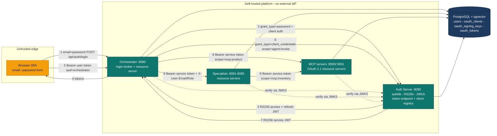

# Phase 2.7 — Self-Hosted OAuth2 Authorization Server (offline, no external IdP)

**Status:** not started · **Depends on:** 09 (public storefront auth split) · **Additive, flag-gated**

## Why

Three trust boundaries currently rely on static, long-lived secrets validated with a single symmetric key:

1. **Browser → Orchestrator** — self-issued HS256 JWT signed with a static `JWT_SECRET`. No token
   endpoint, no key rotation, no standards-based introspection.
2. **Orchestrator → Specialists (A2A)** — a single static `AGENT_SHARED_SECRET` header; forwarded
   `X-User-Email` / `X-User-Role` are trusted on the strength of that one secret.
3. **MCP servers (:9000/:9001)** — zero authentication. Both Python `FastMCP` apps and the .NET MCP
   host accept any caller, with `DATABASE_URL`-backed data access wide open.

An earlier version of this plan fronted all three with **Microsoft Entra ID**. That was rejected: this
platform is offline-first with its own self-hosted registration/login and must not depend on an
external identity provider. This rewrite keeps the OAuth2 goal but moves the issuer *inside the repo*:
a small **self-hosted OAuth2 Authorization Server** becomes the single trusted token issuer for both
the Python and .NET stacks. User login and every service-to-service call become genuinely
OAuth2-compliant — real RS256 tokens, a real token endpoint, a real JWKS — with no internet or cloud
dependency.

Nothing here replaces the current model. Everything is gated behind `AUTH_MODE` (`local` default) and
`MCP_AUTH_ENABLED` (`false` default), so `./scripts/dev.sh` with only an `OPENAI_API_KEY` keeps working
with zero external dependencies. The auth-server is just another container in the compose stack when an
operator opts in.

## Decisions (locked)

- **The Authorization Server is a new standalone service** at `agents/python/auth_server/`, compose
  service `auth-server` on `:8090`. It is the single issuer (`iss`) for both stacks and the only
  component holding the signing private key. Rationale: textbook OAuth2 separates the AS from resource
  servers; the repo already treats "specialist agent" and "MCP server" as independently-runnable
  services with their own Dockerfile target, so a distinct AS is the natural fit and the better teaching
  artifact. Folding token issuance into the orchestrator would blur the resource-server boundary and
  make the .NET stack depend on the Python orchestrator being up for its own service tokens.
- **`AUTH_MODE=local|oauth`** is the master switch. `local` = today's HS256 + shared secret (unchanged
  default). `oauth` = the self-hosted AS everywhere. No mixed mode within a single deployment.
- **Library: `authlib`** (1.6.x, actively maintained). It implements RFC 6749 (AuthorizationServer +
  grant classes), RFC 9068 (JWT-profile access tokens), RFC 6750 (bearer), and RFC 7517/7519 (JWK/JWT
  via `authlib.jose`). We use `authlib.oauth2.rfc6749.AuthorizationServer` (framework-agnostic base —
  there is no official Starlette/FastAPI integration, so ~100 lines of request/response glue), the
  `ClientCredentialsGrant`, `ResourceOwnerPasswordCredentialsGrant`, and `RefreshTokenGrant` grant
  classes, an RFC 9068 JWT access-token generator, and `authlib.jose.JsonWebKey` for the keypair + JWKS.
  **Resource servers do not import authlib** — they verify RS256 with the `jwt.PyJWKClient` already
  present in `shared/auth.py`, keeping specialists/MCP lean.
- **Signing is RS256 with an AS-generated keypair persisted in Postgres** (`oauth_signing_keys`), not a
  shared symmetric secret. The AS mints tokens with the private key; every resource server (orchestrator,
  specialists, MCP, .NET) verifies against the public key fetched from `/.well-known/jwks.json`. No
  resource server ever holds signing material.
- **User login uses the ROPC (`password`) grant, brokered by the orchestrator.** The frontend keeps its
  existing email/password form and keeps calling `/api/auth/login` / `/refresh` / `/signup` — no
  redirect, no browser-to-AS CORS, no client secret in the browser. The orchestrator is a **confidential
  first-party client** that performs the ROPC grant against the AS on the user's behalf and returns the
  resulting RS256 access/refresh tokens to the browser. ROPC is discouraged for *third-party* clients; it
  is legal and appropriate for a confidential first-party client and is the right call to preserve the
  offline login UX. This is a deliberate, documented trade-off, not a reinvented flow. Signup stays an
  app concern at the orchestrator (bcrypt insert into `users`); only credential-exchange moves to the AS.
- **Service-to-service uses the client-credentials grant.** Orchestrator→specialists and
  orchestrator/specialists→MCP each acquire a short-lived RS256 service token (`scope=agent:invoke` or
  `scope=mcp:*`). End-user identity continues to flow in `X-User-Email` / `X-User-Role`; the service
  token authenticates the *caller service*, cryptographically and with expiry, replacing the static
  `AGENT_SHARED_SECRET`. `GUARDRAILS_STRICT_IDENTITY=true` is mandatory in `oauth` mode.
- **Scopes gate API surface; roles gate business logic — never conflated.** Scope set: `api:chat` (user
  token → orchestrator), `agent:invoke` (A2A), `mcp:product` / `mcp:inventory` (per-MCP). Audiences:
  `ecommerce-orchestrator`, `ecommerce-agents`, `mcp-product`, `mcp-inventory`. The `customer|seller|admin`
  role stays a separate custom `role` claim consumed by tool-level RBAC exactly as today.
- **Static, seeded client registry** (`oauth_clients`). This is offline-first with a fixed set of
  first-party clients — no dynamic registration. The seeder provisions one confidential client per
  service; the .NET stack reuses the same `client_id`s (same logical services, mutually exclusive at
  runtime), mirroring the existing byte-compatible-secret design.
- **MCP servers become OAuth 2.1 resource servers** via the `mcp` SDK's `TokenVerifier` + `AuthSettings`
  seam — but the issuer is now the self-hosted AS, not Entra. We write a JWKS-backed `TokenVerifier`
  against the AS. Gated independently via `MCP_AUTH_ENABLED`.
- **No prompt changes.** Identity plumbing only; YAML prompts untouched.

## Target architecture (oauth mode)



Amber marks the only real trust boundary — the untrusted browser edge. Everything else is self-hosted
(teal); data is dark-blue. There is no external-IdP node.

---

## Phase A — Build the Authorization Server

Independently demoable: `curl` the token endpoint with client-credentials, get an RS256 JWT, fetch
`/.well-known/jwks.json` and `/.well-known/oauth-authorization-server`, and validate the token offline
against the JWKS. No consumer service changes yet; `local` stays the default.

**Schema (append to `docker/postgres/init.sql` — additive; existing volumes pick it up on
`dev.sh --clean`)**

- `oauth_clients(client_id PK, client_secret_hash, client_name, is_confidential bool,
  allowed_grant_types text[], allowed_scopes text[], allowed_audiences text[],
  token_endpoint_auth_method text, created_at)`.
- `oauth_signing_keys(kid PK, alg text, public_jwk jsonb, private_pem_enc bytea, is_active bool,
  created_at, retired_at)`.
- `oauth_tokens(id PK, client_id, subject, token_type text, token_hash, scope text, audience text,
  issued_at, expires_at, revoked bool)` — refresh tokens are looked up here for rotation/revocation;
  access tokens stay stateless (validated via JWKS, not stored).

**Steps**

1. **Service skeleton + keypair bootstrap.** New `agents/python/auth_server/` (`main.py`
   Starlette/FastAPI app, `keys.py`, `clients.py`, `grants.py`, `server.py`). On startup, if no active
   row in `oauth_signing_keys`, generate a 2048-bit RSA keypair (`authlib.jose.JsonWebKey`), assign a
   `kid` (thumbprint), store the public JWK + private PEM (encrypted with
   `AUTH_SIGNING_KEY_ENCRYPTION_KEY` when set, else stored plain with a loud dev warning), mark active.
   Expose `/health`, `/.well-known/jwks.json` (all active + not-yet-expired retired keys),
   `/.well-known/oauth-authorization-server` (RFC 8414 metadata: `issuer`, `token_endpoint`, `jwks_uri`,
   `grant_types_supported`, `scopes_supported`). Files: `auth_server/*`, edit
   `agents/python/pyproject.toml` (add `authlib`, `cryptography`), `agents/python/Dockerfile`
   (`AGENT_NAME=auth_server` target or dedicated entrypoint), `docker-compose.yml`,
   `docker/postgres/init.sql`. (~L, 8-10h)
2. **authlib AuthorizationServer wiring.** Subclass `authlib.oauth2.rfc6749.AuthorizationServer` with the
   Starlette request/response bridge (`create_oauth2_request`, `create_json_request`,
   `handle_response`), `query_client` (reads `oauth_clients`), and `save_token` (writes refresh tokens to
   `oauth_tokens`). Register an RFC 9068 JWT access-token generator that signs RS256 with the active key
   and stamps `iss`, `aud`, `exp`, `iat`, `scope`, `sub`, `client_id`, and the `role` claim for user
   tokens. `POST /oauth/token` dispatches to the registered grants. Files: `auth_server/server.py`,
   `auth_server/token.py`. (~M/L, 6-8h)
3. **Grant classes.** `ClientCredentialsGrant` (validate client secret via bcrypt against
   `oauth_clients`, intersect requested vs allowed scopes/audiences), `ResourceOwnerPasswordCredentialsGrant`
   (verify email/password against `users` via existing `verify_password`, stamp `sub`=email + `role`
   claim + `user_id`), `RefreshTokenGrant` (look up `oauth_tokens`, rotate, revoke old). Enforce
   allowed-grant-types per client. Files: `auth_server/grants.py`. (~M, 5-6h)
4. **Client registry + seeder.** `scripts/seed.py::seed_oauth_clients(conn)` upserts the fixed client set
   (below). Dev secrets derived as `hmac_sha256(OAUTH_SEED_KEY, client_id)` so the whole offline stack
   shares one knob (`OAUTH_SEED_KEY`) exactly as `AGENT_SHARED_SECRET` does today, but over a real OAuth2
   wire; the same derivation is what each service uses to authenticate. Production overrides
   per-service secrets out-of-band (documented). Files: `scripts/seed.py`, plus a small
   `auth_server/client_secrets.py` shared derivation used by both seeder and services. (~S/M, 3h)

Seeded clients (confidential):

| client_id | grants | scopes | audiences |
|---|---|---|---|
| `orchestrator` | password, refresh_token, client_credentials | api:chat, agent:invoke, mcp:product, mcp:inventory | ecommerce-agents, mcp-product, mcp-inventory |
| `product-discovery` | client_credentials | agent:invoke, mcp:product | ecommerce-agents, mcp-product |
| `inventory-fulfillment` | client_credentials | agent:invoke, mcp:inventory | ecommerce-agents, mcp-inventory |
| `order-management`, `pricing-promotions`, `review-sentiment` | client_credentials | agent:invoke | ecommerce-agents |

MCP servers are resource servers, not clients — no rows. The .NET orchestrator/specialists reuse these
same `client_id`s.

**Tests (ship with this phase)**
- Unit (no LLM): keypair bootstrap is idempotent (second boot reuses the active key); JWKS serializes
  the public key with the right `kid`/`alg`; RFC 8414 metadata shape. Each grant: client-credentials
  mints a scoped RS256 token and rejects a bad secret / disallowed grant / out-of-scope request; ROPC
  accepts valid creds and rejects wrong password / inactive user; refresh rotates and revokes the prior
  token. Tokens verify against the served JWKS with `PyJWKClient`.
- Integration (`clean_db` testcontainer): run the AS ASGI app in-process (httpx `ASGITransport`) against
  seeded `oauth_clients` + `users`; full `/oauth/token` round trips for all three grants; a revoked
  refresh token is refused.
- Never mock the DB; there is no LLM in this phase.

**Done when**
- The AS issues valid RS256 tokens for client-credentials, password, and refresh grants; JWKS and
  RFC 8414 metadata resolve; tokens validate offline. `AUTH_MODE=local` behavior and the quick-start are
  untouched (the `auth-server` container simply isn't required).

---

## Phase B — User login via the AS (orchestrator broker), Python + .NET

Independently demoable: with `AUTH_MODE=oauth`, a user logs in through the existing form; the
orchestrator brokers ROPC and returns AS-issued RS256 tokens; the orchestrator validates them via JWKS.
A2A and MCP are untouched in this phase.

**Steps**

1. **Resource-server validation abstraction.** Add `shared/oauth/verifier.py` with an `RS256Verifier`
   (`jwt.PyJWKClient(AUTH_SERVER_JWKS_URL)`, TTL-cached, validating `iss`=`AUTH_SERVER_ISSUER`, `aud`,
   `exp`, signature; extracts `sub`/`role`/`user_id`/`scope`). A factory in `shared/factory.py` returns
   the local HS256 path or the RS256 path on `settings.AUTH_MODE`. `AgentAuthMiddleware.dispatch` and
   `orchestrator/routes.py::require_auth`/`optional_auth` call the factory. The HS256 branch keeps its
   `type=="access"` check; the RS256 branch checks `aud` + required scope (`api:chat`) instead. Files:
   `shared/oauth/verifier.py`, `shared/factory.py`, `shared/auth.py`, `orchestrator/routes.py`,
   `shared/config.py`. (~M, 5-6h)
2. **Orchestrator as login broker.** In `oauth` mode, `/api/auth/login` performs `grant_type=password`
   against the AS token endpoint (orchestrator's own client credentials); `/api/auth/refresh` relays
   `grant_type=refresh_token`; both return the AS tokens in the existing `AuthResponse` shape so
   `api.ts`/`auth-context.tsx` need no change. `/api/auth/signup` is unchanged (still bcrypt-inserts the
   `users` row; the subsequent login goes through the AS). Add
   `shared/oauth/service_client.py::request_token(grant, ...)` (httpx, no caching for user grants). In
   `local` mode, all three endpoints behave exactly as today. Files: `orchestrator/routes.py`,
   `shared/oauth/service_client.py`. (~M, 4-5h)
3. **.NET parity.** Extend `AgentAuthMiddleware.cs` to branch on `AgentSettings.AuthMode`: in `oauth`,
   validate RS256 via `ConfigurationManager<OpenIdConnectConfiguration>` pointed at the AS RFC 8414
   metadata (issuer + JWKS), `TokenValidationParameters` with `ValidIssuer=AUTH_SERVER_ISSUER`,
   `ValidAudience=ecommerce-orchestrator`, `ValidateLifetime`, `IssuerSigningKeys` from JWKS; keep the
   HS256 branch for `local`. Broker login in `AuthRoutes.cs` the same way (HttpClient
   client-credentials/password relay). Add `AuthMode`, `AuthServerIssuer`, `AuthServerJwksUrl`,
   `AuthServerTokenUrl`, `OAuthClientId`, `OAuthClientSecret` to `AgentSettings`. No
   `AddAuthentication`/`AddJwtBearer` — extend the existing custom middleware. Files:
   `AgentAuthMiddleware.cs`, `AuthRoutes.cs`, `Auth/JwtTokenService.cs` (RS256 verify helper),
   `Configuration/AgentSettings.cs`. (~M/L, 6-7h)
4. **Startup guardrail.** When `AUTH_MODE=oauth`, fail fast (mirror `_validate_secrets`) if
   `AUTH_SERVER_ISSUER`/`AUTH_SERVER_JWKS_URL`/`OAUTH_CLIENT_ID` are unset or `OAUTH_SEED_KEY` is the dev
   default in a non-dev `ENVIRONMENT`. (~S, 1h)

**Tests**
- Unit (Python, no live AS): mint RS256 tokens with a test RSA keypair, serve the matching JWKS from an
  in-process Starlette stub; `RS256Verifier` accepts valid and rejects wrong `aud`, wrong `iss`, expired,
  tampered, and missing-scope tokens. `local` mode still validates HS256.
- Integration (`clean_db`): login in oauth mode returns AS-issued tokens; a Bearer request with that
  token sets the correct ContextVars and `role`; refresh works; login in `local` mode is byte-for-byte
  unchanged.
- .NET: MSTest with a self-signed RSA key + injected `TokenValidationParameters` — valid/invalid
  audience, issuer, lifetime; HS256 path preserved in `local`.
- Frontend: unit-test that `login()`/`refresh()` are unchanged and mode-agnostic (they still hit
  `/api/auth/*`).

**Done when**
- With `AUTH_MODE=oauth`, a user logs in via the existing form, drives chat end-to-end on an AS-issued
  RS256 token, and refresh works — Python and .NET. `local` mode and the quick-start are unchanged.

---

## Phase C — Inter-agent OAuth (client credentials), Python + .NET

Independently demoable: A2A calls carry an AS-issued service token; `AGENT_SHARED_SECRET` is disabled in
`oauth` mode; an invalid/expired/wrong-audience token is rejected 401.

**Steps**

1. **Cached service-token acquirer.** Extend
   `shared/oauth/service_client.py::acquire_service_token(scope, audience)` — client-credentials against
   the AS, in-process cache keyed by `(scope, audience)` honoring `exp` with a refresh skew. Files:
   `shared/oauth/service_client.py`. (~S/M, 3h)
2. **Caller side.** In `oauth` mode, `shared/remote_agent.py::_post` and
   `orchestrator/agent.py::call_specialist_agent` attach `Authorization: Bearer <agent:invoke token>`
   (aud `ecommerce-agents`) instead of `x-agent-secret`, still forwarding
   `x-user-email`/`x-user-role`/`x-session-id`. `local` mode unchanged. Files: `shared/remote_agent.py`,
   `orchestrator/agent.py`. (~S/M, 3h)
3. **Callee side.** In `oauth` mode the specialist `AgentAuthMiddleware` (Python + .NET) authenticates an
   inter-agent request by validating the RS256 service token (aud `ecommerce-agents`, required scope
   `agent:invoke`) rather than comparing the shared secret; forwarded identity headers then populate
   ContextVars with `GUARDRAILS_STRICT_IDENTITY` enforced. System/health flows carry a token with no
   user headers, mapping to `role=system`. Files: `shared/auth.py`, `AgentAuthMiddleware.cs`. (~M, 4-5h)
4. **Retire the shared secret in oauth mode.** Guard: in `oauth` mode `AGENT_SHARED_SECRET` is ignored
   and an `x-agent-secret`-only request is rejected. Config guardrail fails fast if `oauth` mode lacks
   the acquirer prerequisites. (~S, 1h)

**Tests**
- Unit: service-token validation accepts correct aud + `agent:invoke`; rejects a user-audience token
  (`api:chat`), a token missing the scope, an expired token, and one signed by an unknown key. Acquirer
  caches and refreshes on skew (AS mocked — no live AS).
- Integration (`clean_db`): full orchestrator-to-specialist round trip in oauth mode against the
  in-process AS; ContextVars propagate; a spoofed `X-User-Role` is rejected under strict identity;
  `local` round trip unchanged.
- .NET parity mirrors the above.

**Done when**
- In oauth mode A2A works on AS service tokens with no `AGENT_SHARED_SECRET`; bad tokens are 401; `local`
  mode still uses the shared secret unchanged — both stacks.

---

## Phase D — MCP servers as OAuth 2.1 resource servers, Python + .NET

Independently demoable: unauthenticated `/mcp` calls get `401` + `WWW-Authenticate`;
`/.well-known/oauth-protected-resource` resolves and points at the AS; authenticated specialist calls
succeed.

**Steps**

1. **JWKS `TokenVerifier`.** Shared `JwksTokenVerifier(mcp.server.auth.provider.TokenVerifier)` used by
   both packages: validate the bearer JWT via `PyJWKClient(AUTH_SERVER_JWKS_URL)` (aud = this server's
   resource, iss = `AUTH_SERVER_ISSUER`, required scope `mcp:product`/`mcp:inventory`), return
   `AccessToken(token, client_id, scopes, expires_at)`. When `MCP_AUTH_ENABLED=true`, construct
   `FastMCP(..., token_verifier=verifier, auth=AuthSettings(issuer_url=AUTH_SERVER_ISSUER,
   resource_server_url=<canonical MCP URL>, required_scopes=[...]))`; the SDK auto-mounts
   `/.well-known/oauth-protected-resource` and wraps `/mcp` in `RequireAuthMiddleware` (401 +
   `WWW-Authenticate`). Flag off → servers stay bare (unchanged quick-start). This is the official `mcp`
   SDK seam, **not** the standalone `fastmcp` 2.x `JWTVerifier`. Files: a shared auth module reused by
   both packages, `packages/mcp-product/.../server.py`, `packages/mcp-inventory/.../server.py`. (~M/L,
   6-8h)
2. **MCP client token acquisition.** In `oauth` mode with `MCP_AUTH_ENABLED`, the `MCPStreamableHTTPTool`
   construction in `product_discovery/agent.py` and `inventory_fulfillment/agent.py` attaches a bearer
   token for the MCP resource via `acquire_service_token(scope="mcp:product"|"mcp:inventory",
   audience=...)` (RFC 8707 resource indicator = the canonical MCP URL). Files: the two agent factories.
   (~S/M, 3h)
3. **.NET parity.** In `ECommerceAgents.Mcp`, add RS256 JWKS validation to `McpEndpoints.cs` (reuse the
   Phase B `JwtTokenService` verify helper against the AS JWKS), gate the tool routes on a valid token
   when `MCP_AUTH_ENABLED`, and hand-roll `GET /.well-known/oauth-protected-resource`
   (`{ resource, authorization_servers:[issuer], scopes_supported }`) plus a `WWW-Authenticate` header on
   401. Still no `AddMicrosoftIdentityWebApi` — custom validation matching the Python behavior. Files:
   `McpEndpoints.cs`, `Program.cs`. (~M, 4h)
4. **Compose + docs.** Extend the `mcp` profile services with the new auth env; document the
   protected-resource discovery flow (including an external client like MCP Inspector completing
   discovery against the self-hosted AS) in `docs/mcp-integration.md`. (~S, 2h)

**Tests**
- Unit (Python): `JwksTokenVerifier` accepts a correctly-scoped stub token, rejects wrong aud / missing
  scope / expired; unauthenticated `/mcp` returns 401 + `WWW-Authenticate`;
  `/.well-known/oauth-protected-resource` returns `resource` + `authorization_servers` = the AS issuer.
- Integration (`clean_db`): a specialist with `MCP_ENABLED=true` + `MCP_AUTH_ENABLED=true` acquires a
  token from the in-process AS and calls a tool successfully; the same call without a token is rejected;
  with `MCP_AUTH_ENABLED=false` the server behaves exactly as today (regression guard).
- .NET: MSTest — token-gated routes 401 without a token, 200 with a valid one; metadata +
  `WWW-Authenticate` shape.

**Done when**
- With `MCP_AUTH_ENABLED=true`, both Python servers and the .NET host reject unauthenticated calls with
  spec-compliant `401` + `WWW-Authenticate`, expose protected-resource metadata pointing at the
  self-hosted AS, and serve authenticated specialist calls. Flag off → MCP quick-start unchanged.

---

## Phase E — Docs, audit matrix, and roadmap wiring

**Steps**

1. **`docs/security-guide.md`.** Update the threat-model table and Authentication section for the
   self-hosted AS path; add an "OAuth2 Authorization Server (self-hosted) — Optional" section mirroring
   the existing Content Safety section (flag-gated, additive); replace the hardening-checklist rows.
   (~S, 2h)
2. **`docs/agent-audit-matrix.md`.** Add an auth-mode column per surface (orchestrator, each specialist,
   each MCP server, .NET port) so open-vs-closed status is legible. (~S, 1h)
3. **`README.md` Roadmap.** Replace the previous Entra bullet with the self-hosted description; flip to
   Shipped only when A-E land and verify. (~S, 0.5h)
4. **`.env.example` + `docs/mcp-integration.md`.** Add all new keys with safe defaults and inline
   comments; document the AS service, `AUTH_MODE`/`MCP_AUTH_ENABLED`, and how to run oauth mode locally
   with `docker compose --profile agents up`. (~S, 1.5h)

**Done when**
- Security guide, audit matrix, README roadmap, and `.env.example` reflect the self-hosted AS; a reader
  can stand up oauth mode from docs alone with no cloud account; the quick-start docs still show a
  zero-dependency default.

---

## Config additions (`shared/config.py`, all safe defaults preserve quick-start)

```python
# -- Auth mode ------------------------------------------------------
AUTH_MODE: str = "local"                       # local | oauth

# -- Self-hosted Authorization Server (AUTH_MODE=oauth) -------------
AUTH_SERVER_ISSUER: str = "http://localhost:8090"
AUTH_SERVER_JWKS_URL: str = "http://localhost:8090/.well-known/jwks.json"
AUTH_SERVER_TOKEN_URL: str = "http://localhost:8090/oauth/token"
AUTH_ACCESS_TOKEN_TTL: int = 3600              # seconds
AUTH_REFRESH_TOKEN_TTL: int = 604800           # 7 days
AUTH_JWKS_CACHE_TTL: int = 900                 # resource-server JWKS cache
AUTH_RSA_KEY_SIZE: int = 2048                  # auth-server only
AUTH_SIGNING_KEY_ENCRYPTION_KEY: str = ""      # optional KEK for private PEM at rest

# -- OAuth client identity (per service; AUTH_MODE=oauth) -----------
OAUTH_CLIENT_ID: str = ""                      # defaults to the service name
OAUTH_CLIENT_SECRET: str = ""                  # prod override; dev derives from OAUTH_SEED_KEY
OAUTH_SEED_KEY: str = "dev-oauth-seed-change-me"  # dev shared knob; unsafe in prod

# Resource-server expectations
AUTH_ORCH_AUDIENCE: str = "ecommerce-orchestrator"
AUTH_AGENT_AUDIENCE: str = "ecommerce-agents"

# -- MCP resource-server auth (independent of MCP_ENABLED) -----------
MCP_AUTH_ENABLED: bool = False
MCP_PRODUCT_AUDIENCE: str = "mcp-product"
MCP_INVENTORY_AUDIENCE: str = "mcp-inventory"
MCP_PRODUCT_REQUIRED_SCOPE: str = "mcp:product"
MCP_INVENTORY_REQUIRED_SCOPE: str = "mcp:inventory"
MCP_PRODUCT_RESOURCE_URL: str = "http://localhost:9000/mcp"   # canonical aud + RFC 8707 resource
MCP_INVENTORY_RESOURCE_URL: str = "http://localhost:9001/mcp"
```

Extend `_validate_secrets` to (a) fail fast in `oauth` mode when `AUTH_SERVER_*`/`OAUTH_CLIENT_ID` are
empty, and (b) reject the `OAUTH_SEED_KEY` / `AUTH_SIGNING_KEY_ENCRYPTION_KEY` dev defaults when
`ENVIRONMENT` is production — same shape as the existing `JWT_SECRET`/`AGENT_SHARED_SECRET` checks.

**`.env.example`** — add a `# -- OAuth (optional; AUTH_MODE=oauth) --` block with the keys above (all
blank/defaulted), plus `NEXT_PUBLIC_AUTH_MODE=local` for parity (the frontend needs no OAuth keys because
the orchestrator brokers login).

**`docker-compose.yml`:**
- New `auth-server` service (profile `agents`), build context `./agents/python` with
  `AGENT_NAME: auth_server`, `AGENT_PORT: 8090`, `ports: ["8090:8090"]`, `depends_on: db healthy`, env:
  `DATABASE_URL`, `AUTH_SERVER_ISSUER`, `AUTH_RSA_KEY_SIZE`, `AUTH_SIGNING_KEY_ENCRYPTION_KEY`,
  `OAUTH_SEED_KEY`, `AUTH_ACCESS_TOKEN_TTL`, `AUTH_REFRESH_TOKEN_TTL`, `ENVIRONMENT`.
- The shared agent-env anchor gains `AUTH_MODE`, `AUTH_SERVER_ISSUER: http://auth-server:8090`,
  `AUTH_SERVER_JWKS_URL: http://auth-server:8090/.well-known/jwks.json`,
  `AUTH_SERVER_TOKEN_URL: http://auth-server:8090/oauth/token`, `OAUTH_SEED_KEY`, `AUTH_JWKS_CACHE_TTL`.
- Each service block adds its own `OAUTH_CLIENT_ID:` override (like `OTEL_SERVICE_NAME`), e.g.
  `product-discovery` → `OAUTH_CLIENT_ID: product-discovery`.
- The `mcp-product` / `mcp-inventory` services gain `MCP_AUTH_ENABLED`, `AUTH_SERVER_ISSUER`,
  `AUTH_SERVER_JWKS_URL`, and their `MCP_*_AUDIENCE` / `MCP_*_REQUIRED_SCOPE` / `MCP_*_RESOURCE_URL`.
- `seeder` gains `OAUTH_SEED_KEY` so `seed_oauth_clients` can hash matching dev secrets.

## Gotchas

- **ROPC is only defensible because of the confidential first-party broker.** The browser must never
  hold a client secret or call `/oauth/token` directly. Keep login flowing through the orchestrator
  (`/api/auth/login` → orchestrator client-credentials + ROPC → tokens back). If anyone later wires the
  SPA straight to the AS token endpoint, that creates an unauthenticated public ROPC client — document
  this hard in the security guide.
- **Signing-key persistence and rotation.** Store the private PEM encrypted
  (`AUTH_SIGNING_KEY_ENCRYPTION_KEY`) — an unencrypted private key in Postgres is a real finding; the
  plain-storage dev fallback must warn loudly and be blocked in production. Rotation = insert a new
  active key with a fresh `kid` while keeping the retiring key in JWKS until the longest-lived token
  (7-day refresh) expires; never drop a `kid` still present in a live token. Resource-server JWKS caches
  (`AUTH_JWKS_CACHE_TTL`) mean rotation isn't visible instantly — size the overlap window larger than the
  cache TTL.
- **Testcontainer strategy for the AS itself.** Don't spin a second AS container in tests. Run the AS
  ASGI app in-process (httpx `ASGITransport`) against the `clean_db` testcontainer, and for pure
  resource-server unit tests serve a JWKS from a tiny Starlette stub signed with a per-test RSA keypair.
  That keeps the "never mock the DB, never call a live service" rule while staying fast.
- **Issuer/JWKS URL differs by network vantage.** Inside compose the AS is `http://auth-server:8090`;
  from the host/browser it's `http://localhost:8090`. The `iss` stamped into tokens is validated verbatim
  by resource servers, so pick one canonical issuer value and make sure every consumer resolves the same
  JWKS host. Mismatched issuer/aud strings (trailing slash, scheme, host casing) are the classic
  "everything 401s with an unhelpful message" failure — the MCP `resource_server_url`, the token `aud`,
  and `MCP_*_RESOURCE_URL` must be byte-identical.
- **Migration path for existing local tokens.** Flipping `AUTH_MODE` invalidates in-flight tokens (HS256
  and RS256 are not cross-verifiable). Treat mode changes as a redeploy that forces re-login; the
  frontend's existing 401→`/login` bounce already handles it. `users` rows and bcrypt hashes are
  untouched, so the same accounts work in both modes.
- **`authlib` has no Starlette integration.** The high-level integrations are Flask/Django only; the
  FastAPI/Starlette bridge is yours to write against the `authlib.oauth2.rfc6749.AuthorizationServer`
  base (request adaptation + response handling). It's modest and well-documented, but budget for it in
  Phase A and don't reach for a Flask shim.

## Out of scope (for now)

- Authorization Code + PKCE / a hosted login page — unnecessary while the SPA is first-party and the
  orchestrator brokers ROPC. Documented as a future upgrade if a third-party client ever needs access.
- Token exchange (RFC 8693) for true per-hop end-user assurance downstream — service tokens authenticate
  the caller service; end-user identity still rides in forwarded headers under strict identity.
- Retiring `local` mode — it stays the zero-dependency default for the quick-start and CI.
- Dynamic client registration and external-customer identity federation — the client set is fixed and
  seeded.

## Related documents

- [`docs/security-guide.md`](../../../docs/security-guide.md) — threat model, guardrails stack,
  authentication flow, hardening checklist
- [`docs/mcp-integration.md`](../../../docs/mcp-integration.md) — MCP server setup and tool coverage
- [MCP Authorization spec (2025-06-18)](https://modelcontextprotocol.io/specification/2025-06-18/basic/authorization)
- [authlib — OAuth 2.0 provider](https://docs.authlib.org/en/latest/flask/2/index.html) (grant classes,
  JWT bearer generator, JWK)
